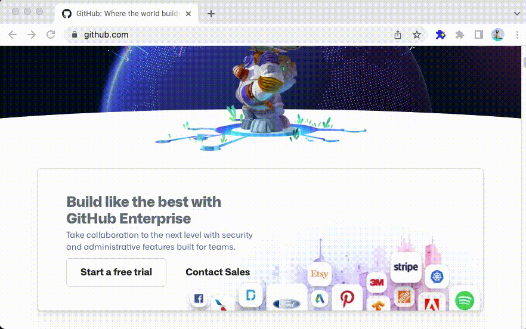

# Simple Sceenshotter

Simple extension to capture screenshots of elements on the page made with [create-extension](https://www.npmjs.com/package/create-extension)

## Installation

- Clone this repository
- `npm install`
- `npm run build-dev`
- [Load an unpacked extension](https://developer.chrome.com/docs/extensions/mv3/getstarted/#unpacked)
